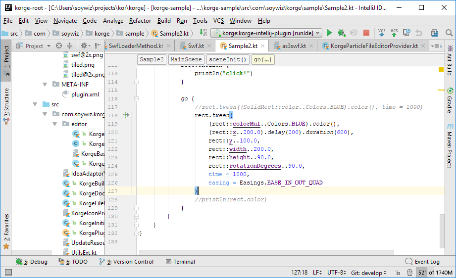
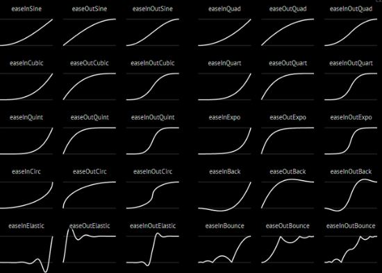

Games require tweening visual properties in order to be appealing.
Korge provides a simple, yet powerful interface for creating tweens.



### Simple interface


`View` has an extension method called `View.tween` that allows you to do the magic. And has the following definition:

```
suspend fun View?.tween(vararg vs: V2<*>, time: Int, easing: Easing = Easing.LINEAR, callback: (Double) -> Unit = { })
```

You have to use [bound callable references](https://kotlinlang.org/docs/reference/whatsnew11.html#bound-callable-references) to define properties that will change. And Korge provides some extension methods to bound callable references to generate tween parameters.

If you want to linearly interpolate `view.x` from `10.0` to `100.0` in one second you would write:
```
view.tween(view::x[10.0, 100.0], time = 1000)
```

### Interpolating Colors

Since in KorGE 1.0 (until [project valhalla](https://en.wikipedia.org/wiki/Project_Valhalla_(Java_language)) is available), colors are represented as RGBA Integers. Which are not directly interpolable.
KorGE provides an extension method `V2.color():V2` to decorate interpolation with a color interpolation. You can use it:

```
view.tween(view::colorMul[Colors.WHITE, Colors.RED].color(), time = 1000)
```

### delay + duration + easing

You can control the start time, duration and easing per interpolated property. Using theesee V2 extensions:

`V2.delay(timeMs:Int):V2`, `V2.duration(timeMs:Int):V2`, `V2.easing(easing:Easing):V2`

```
view.tween(
  view::x[100.0].delay(100).duration(500).easing(Easings.EASE_IN_OUT_QUAD),
  view::y[0.0, 200.0].delay(50),
  time = 1000
)
```

### Implementation details

The tween execution will be attached as a component to the receiver View that holds the tween method. That means that the view has to be in the stage or be manually updated. Also means that any `View.speed` changes in that view or ancestors will affect the tween.

*PRO Tip:* You can even interpolate the `View.speed` property to get some cool time effects.

### Easings

Korge provides an Easing class with the most common easings. And allows
you to create your own easings.



* Easings.EASE_IN_ELASTIC
* Easings.EASE_OUT_ELASTIC
* Easings.EASE_OUT_BOUNCE
* Easings.LINEAR
* Easings.EASE_IN
* Easings.EASE_OUT
* Easings.EASE_IN_OUT
* Easings.EASE_OUT_IN
* Easings.EASE_IN_BACK
* Easings.EASE_OUT_BACK
* Easings.EASE_IN_OUT_BACK
* Easings.EASE_OUT_IN_BACK
* Easings.EASE_IN_OUT_ELASTIC
* Easings.EASE_OUT_IN_ELASTIC
* Easings.EASE_IN_BOUNCE
* Easings.EASE_IN_OUT_BOUNCE
* Easings.EASE_OUT_IN_BOUNCE
* Easings.EASE_IN_QUAD
* Easings.EASE_OUT_QUAD
* Easings.EASE_IN_OUT_QUAD
